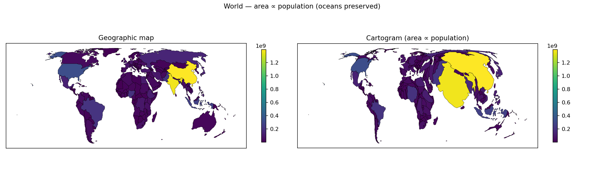
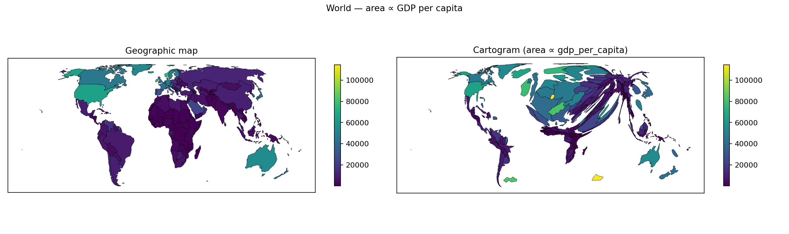
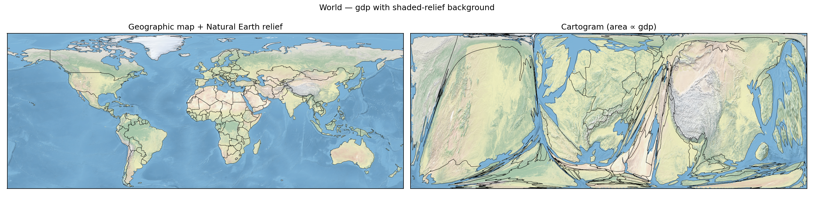
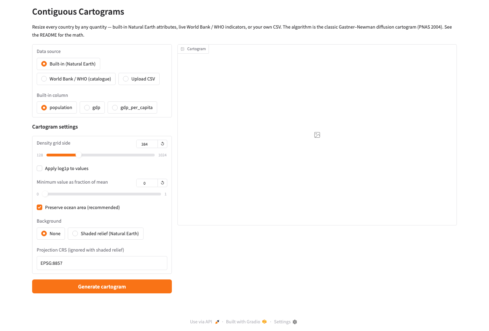
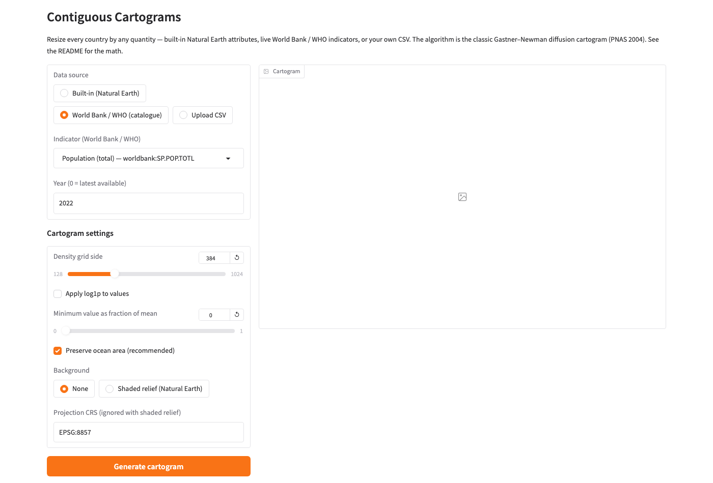
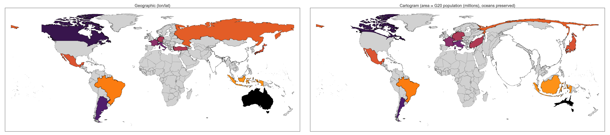
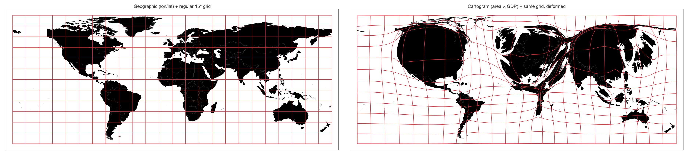
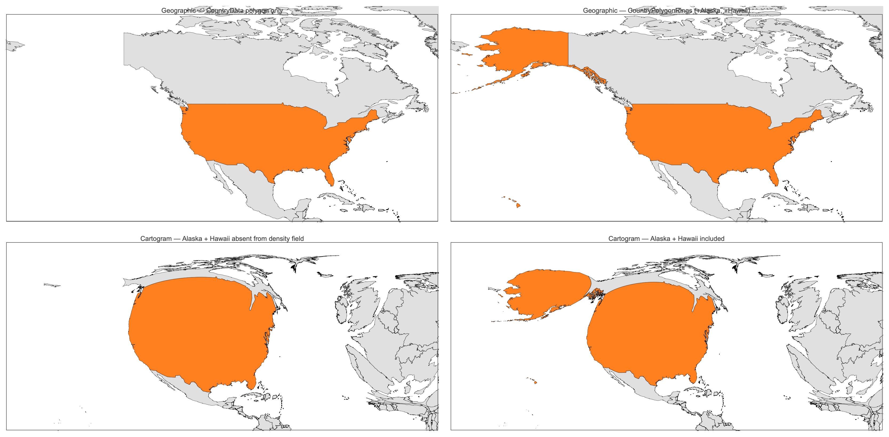

# Contiguous Cartograms

A small, auditable, pure-Python implementation of the
**Gastner–Newman diffusion cartogram algorithm** (PNAS 2004) for
producing *contiguous* density-equalising cartograms — maps where the
area of each region is proportional to some quantity (population, GDP,
life expectancy, CO₂ emissions, votes, cases, …) while neighbouring
regions stay attached and no topology is destroyed.

The package ships with:

* a pure NumPy/SciPy implementation of the algorithm (DCT-II analytic
  diffusion + RK45 advection of points and polygons);
* a **Natural Earth world map loader** with built-in `population`,
  `gdp`, and `gdp_per_capita` attributes;
* **live fetchers for the World Bank Open Data and WHO Global Health
  Observatory APIs** — no API keys required;
* **CSV-upload ingestion** so any `{ISO3, value}` table becomes a
  cartogram;
* an **ocean-area-preservation mode** that keeps the sea roughly where
  it is while only resizing land masses relative to each other;
* a **satellite/shaded-relief background warping** capability — imagery
  is pulled back through the inverse deformation and distorts with the
  country outlines;
* a **Gradio web GUI** that exposes all of the above point-and-click;
* a **command-line tool** (`python -m cartogram …`) for reproducible
  batch runs.

## Gallery

### Synthetic demo (no geodata)


### World — area ∝ population (ocean area preserved)



### World — area ∝ GDP


### World — area ∝ GDP per capita



Note: this image is produced *without* `--log`. Log-scaling a heavy-tailed
quantity like GDP/capita compresses the $240–$125 000 spread into the
6–12 range, which is then barely distinguishable from the per-cell area
noise and lets the cartogram inflate regions with large area rather
than high value. For GDP/capita, raw values + a small `--min-floor`
reproduces the expected picture (Europe / North America / Australia
expanded; sub-Saharan Africa, South Asia, parts of Southeast Asia
shrunk).

### World — population cartogram with Natural Earth shaded relief warped through the same deformation


### World — GDP cartogram with shaded relief



### Aggressive legacy mode — population, no ocean preservation


### The Gradio GUI

Left-hand panel: pick source (built-in, WB/WHO, upload), tune
parameters, toggle ocean preservation / background. Right-hand panel:
preview.




## Mathematical background

Given a non-negative density `ρ₀(x, y)` on a rectangle, we look for a
smooth, invertible deformation `Φ : R² → R²` such that the pulled-back
density is uniform. Gastner & Newman construct `Φ` by solving the
diffusion equation on a Neumann box,

```
∂ρ/∂t = ∇²ρ ,    (∂ρ/∂n)|∂Ω = 0 ,
```

and advecting every point along the associated normalised flux

```
v(x, t) = − ∇ρ(x, t) / ρ(x, t) ,    dr/dt = v(r, t).
```

The position `r(∞)` is the cartogram coordinate of `r₀`. Because the
deformation is the flow of a smooth velocity field, it is a
homeomorphism — contiguity is preserved automatically.

Implementation notes:

* the heat equation is solved *exactly* on the Neumann box via DCT-II
  cosine expansion (so `ρ(t)` is available at any `t` with a single
  `O(N log N)` transform — no time-stepping for diffusion);
* the density is pre-smoothed with a small Gaussian so that the
  polygon-rasterisation step-functions do not make the advection ODE
  stiff at `t = 0` — mathematically equivalent to starting the heat
  equation at `t = σ² dx dy / 2`;
* the advection ODE is integrated with SciPy's adaptive RK45;
* country boundaries are densified via `shapely.segmentize` before
  transformation so long straight edges follow the flow faithfully;
* **ocean preservation** (`sea_density="auto"`): cells with zero input
  density are filled with the *mean of the land density*. The spatial
  mean is then the same on land and sea, so the diffusion only
  redistributes material *within* the land. Oceans keep their area;
  only the relative sizes of countries change.

## Installation

```bash
python3 -m venv .venv
source .venv/bin/activate
pip install -r requirements.txt

# Optional stacks (edit requirements.txt to enable, or install directly):
pip install geopandas rasterio pillow   # world maps + shaded relief
pip install gradio pandas               # GUI
```

## The Gradio GUI (recommended starting point)

```bash
python -m cartogram gui
# opens http://127.0.0.1:7860 in your browser
```

What it gives you, with no code:

| Data source | What you pick | What happens |
|---|---|---|
| **Built-in (Natural Earth)** | `population`, `gdp`, or `gdp_per_capita` | Uses the attributes bundled with the Natural Earth admin-0 shapefile. |
| **World Bank / WHO (catalogue)** | any of ~20 curated indicators (population, GDP, CO₂ emissions, life expectancy, internet users, child mortality, forest area, tourist arrivals, alcohol consumption, malaria incidence, …) + a year | The indicator is fetched live from the public APIs and cached on disk. |
| **Upload CSV** | a CSV file with an ISO-3 column and a value column | Values are joined onto the world map by ISO3. |

Cartogram settings:

* **Density grid side** — 128–1024 cells per side. Higher = smoother
  boundaries, slower.
* **Apply log1p** — recommended for heavy-tailed quantities (GDP,
  CO₂).
* **Minimum value as fraction of mean** — clamps from below;
  stabilises cartograms where a few countries have near-zero values.
* **Preserve ocean area (recommended)** — the toggle that turns on
  `sea_density="auto"`. With this on, continents remain recognisable
  and the map doesn't warp into a blob even for extreme distributions.
* **Background** — either none (flat colour-coded) or *Shaded relief
  (Natural Earth)*. With shaded relief, the raster is downloaded on
  first use and warped through the inverse deformation so the imagery
  follows the cartogram distortion.
* **Projection CRS** — any PROJ/EPSG string. Default Equal Earth
  (EPSG:8857). Ignored when shaded relief is on, which forces
  EPSG:4326 to align the raster.

The right-hand pane shows a side-by-side before/after render and a
diagnostic line reporting the ocean-area share before and after
deformation — so you can tell at a glance whether your parameters are
sensible.

## Quick start — the Python API

### 1. Density grid → cartogram

```python
import numpy as np
from cartogram import Cartogram

rho = np.ones((256, 256))
rho[96:160, 96:160] = 5.0   # a dense central block

cart = Cartogram(rho, bbox=(0, 0, 1, 1))
cart.run()

pts = np.array([[0.25, 0.25], [0.75, 0.75]])
cart.transform(pts)          # -> cartogram coordinates
cart.inverse_transform(pts)  # -> pull-back
```

### 2. Polygons + per-polygon values → cartogram

```python
from shapely.geometry import Polygon
from cartogram import Cartogram, rasterize_polygons

polys = [Polygon([(0,0),(1,0),(1,1),(0,1)]),
         Polygon([(1,0),(2,0),(2,1),(1,1)])]
values = [3.0, 1.0]

bbox = (0.0, 0.0, 2.0, 1.0)
rho  = rasterize_polygons(polys, values, bbox, (128, 256))

cart = Cartogram(rho, bbox=bbox, sea_density="auto")  # preserve background
cart.run()

new_polys = cart.transform_polygons(polys)
```

### 3. Built-in world map

```python
from cartogram import WorldMap, Cartogram, rasterize_polygons

wm = WorldMap.load()              # Natural Earth admin-0, cached
wm = wm.pick("population")        # or "gdp", "gdp_per_capita"

bbox = wm.padded_bbox(pad=0.02)
rho  = rasterize_polygons(list(wm.gdf.geometry),
                          list(wm.gdf["population"]),
                          bbox, (256, 512))

cart = Cartogram(rho, bbox=bbox, sea_density="auto")
cart.run()

new_geoms = cart.transform_polygons(list(wm.gdf.geometry))
```

### 4. Live World Bank / WHO data

```python
from cartogram.data_sources import fetch_worldbank, fetch_who, INDICATOR_CATALOGUE
from cartogram import WorldMap

# List what's in the catalogue:
for i in INDICATOR_CATALOGUE:
    print(i.source, i.code, i.label)

# Pull CO2 emissions per capita from the World Bank (cached on disk):
co2 = fetch_worldbank("EN.ATM.CO2E.PC", year=2020)

# Pull life expectancy from WHO:
life = fetch_who("WHOSIS_000001", year=2021)

wm = WorldMap.load().with_values(co2,  join_key="ISO_A3", as_column="co2_pc")
```

### 5. Your own CSV

```python
import pandas as pd
from cartogram import WorldMap

df = pd.read_csv("my_data.csv")              # columns: iso3, my_metric
wm = (WorldMap.load()
        .with_values(df, join_key="ISO_A3",
                     value_key="my_metric",
                     as_column="x"))
```

### 6. Warp a raster image through the cartogram

```python
import numpy as np
from PIL import Image
from cartogram import warp_image

img = np.asarray(Image.open("satellite.png").convert("RGB"))
warped = warp_image(cart, img, image_bbox=bbox)
```

## The command line

```bash
# Built-in, attribute-driven:
python -m cartogram world --value population --preserve-oceans --out pop.png
python -m cartogram world --value gdp --preserve-oceans --out gdp.png
python -m cartogram world --value gdp_per_capita \
                          --min-floor 0.1 --preserve-oceans --out gpc.png

# Any CSV with ISO_A3 + value columns:
python -m cartogram world --value custom \
    --csv co2_per_capita_2020.csv --csv-iso-col iso3 --csv-value-col co2 \
    --preserve-oceans --out co2.png

# Arbitrary shapefile + numeric column:
python -m cartogram shape states.shp --value POP2020 --preserve-oceans \
                                     --out states.png

# Launch the web GUI:
python -m cartogram gui
```

Full CLI options: `python -m cartogram world --help`.

## Why ocean preservation matters

Run the same population cartogram twice, once without and once with
`--preserve-oceans`:

| | `docs/images/world_population.png` | `docs/images/world_population_preserve_oceans.png` |
|---|---|---|
| Behaviour | land and sea both deform, so oceans inflate or compress to fill the rectangle | land-mass areas change; oceans stay roughly the same size |
| Good for | illustrating the raw density field | communicating relative sizes of countries |

Mathematically this is a one-line change to the density field: set
ocean cells (cells with zero input density) to the mean of the land
cells, so the total density is uniform. The cartogram then only
redistributes material within the land.

## Wolfram-Language implementation

A full from-scratch port of the algorithm lives in [`wolfram/`](wolfram/)
as a self-contained package called `CartogramWL`. It uses only built-in
Wolfram functionality (no external dependencies at all) and exposes
both a one-line driver over the built-in `CountryData` database and the
low-level algorithmic primitives, so the same code can be used from a
casual notebook session or as a `wolframscript` batch step.


*Figure: `WorldCartogram["GDP", "Background" -> "Satellite"]` — left,
the geographic world with satellite imagery clipped to each country;
right, the same countries with area proportional to GDP, the satellite
imagery deformed along with the geometry. Ocean area is preserved.*

### What you get

* **`WorldCartogram[metric, opts]`** — a single call that reads country
  polygons + values from `CountryData`, runs the full Gastner–Newman
  pipeline, and returns a publication-ready `GraphicsRow` showing the
  geographic map beside the cartogram.
* A documented set of **algorithm primitives** (`DiffusionSolver`,
  `AdvectPoints`, `Cartogram`, `CartogramRun`, `CartogramTransform`,
  `CartogramTransformPolygon`, `RasterizePolygons`) for users who want
  to build cartograms from their own data on any rectangular domain.
* Built-in support for **satellite-textured rendering**
  (`"Background" -> "Satellite"`), **user-supplied data as an
  `Association`**, **multi-part countries** (Alaska + Hawaii are
  spliced in for the US automatically), and a
  **`PerformanceGoal -> "Speed"`** default that runs the full world
  pipeline in under a minute with sub-pixel agreement with the exact
  reference solution.
* A **distortion-grid visualiser** that overlays a regular lat/lon
  grid and warps it through the same flow field, so readers can see
  the local stretching and compression at a glance.

### Installing and loading

Clone the repository and load the package directly — no paclet
registration required:

```wolfram
Get["/path/to/Contiguous-Cartograms/wolfram/CartogramWL/CartogramWL.wl"]
```

All public symbols are now available in the `CartogramWL`` context.
`?WorldCartogram` prints the full option list inside a notebook.

### The one-liner: `WorldCartogram`

Given just a metric name, `WorldCartogram` takes care of everything:
pulling country polygons and values from `CountryData`, handling
heavy-tailed outliers, rasterising, running the cartogram, densifying
and warping each country polygon, and assembling a two-panel figure.

```wolfram
WorldCartogram["Population"]     (* the canonical cartogram *)
WorldCartogram["GDP"]
WorldCartogram["GDPPerCapita"]
WorldCartogram["PopulationDensity"]
```

Each call returns a `GraphicsRow` with the geographic panel on the
left and the density-equalised cartogram on the right, using
`ColorData["SunsetColors"]` on a log-scale by default.

| Metric | Output |
|---|---|
| `"Population"` |  |
| `"GDP"` |  |
| `"GDPPerCapita"` |  |
| `"PopulationDensity"` |  |

### What the first argument can be

`WorldCartogram` is flexible about where the per-country numbers come
from:

* **A recognised metric string** — `"Population"`, `"GDP"`,
  `"GDPPerCapita"`, `"PopulationDensity"` (case-insensitive). Ships
  with sensible defaults for the floor/ceiling clipping that tames
  heavy-tailed outliers.
* **Any other `CountryData` property name** — a string like
  `"LifeExpectancy"` or `"CO2Emissions"` is looked up on the fly.
* **A pure function** — `Function[c, …]` that returns a `Quantity`
  or numeric value for each country entity `c`. Lets you compute
  anything you like from `CountryData`.
* **An `Association`** — `<|"UnitedStates" -> 332., "China" -> 1425.,
  …|>`. Keys may be `CountryData` identifiers
  (e.g. `"UnitedStates"`) or display names
  (e.g. `"United States"`). Countries not present in the association
  are skipped (or drawn in grey, see `"MissingCountries"` below).
* **A labelled form** `{"my label", fn_or_association}` — supplies
  both the data and the panel title.

```wolfram
(* Built-in metric *)
WorldCartogram["Population"]

(* Any CountryData property *)
WorldCartogram["LifeExpectancy",
   "ColorFunction" -> ColorData["ThermometerColors"]]

(* Custom function *)
WorldCartogram[{"CO2 per capita",
   Function[c, QuantityMagnitude[CountryData[c, "CO2Emissions"]] /
              QuantityMagnitude[CountryData[c, "Population"]]]}]

(* User Association *)
g20 = <|"UnitedStates" -> 332., "China" -> 1425., "India" -> 1428.,
        "Japan" -> 125., "Germany" -> 83., "UnitedKingdom" -> 67.,
        "France" -> 67.5, "Italy" -> 59., "Brazil" -> 216.,
        "Canada" -> 39., "Russia" -> 144., "Australia" -> 26.,
        "SouthKorea" -> 52., "Mexico" -> 128., "Indonesia" -> 278.,
        "SouthAfrica" -> 60., "Argentina" -> 46., "Turkey" -> 85.,
        "SaudiArabia" -> 36.|>;
WorldCartogram[{"G20 population (millions)", g20},
   "MissingCountries" -> "ShowGrey"]
```


*Figure: the same `WorldCartogram` driven by a hand-curated
`Association` of 19 economies. Every other country is drawn in grey,
does not contribute to the density field, but still visibly deforms
because diffusion is global.*

### Option reference

All options are passed as `"Name" -> value`. Defaults are shown in
bold.

| Option | Values | Purpose |
|---|---|---|
| `"ColorFunction"` | any `ColorData[…]` gradient or a function `[0,1] -> RGBColor`; default **`ColorData["SunsetColors"]`** | Fills each country with `colorFn[normalisedLogValue]`. Swap for `TemperatureMap`, `ThermometerColors`, `AvocadoColors`, etc. |
| `"Background"` | **`"Flat"`** or `"Satellite"` | `"Satellite"` textures each country with the matching patch of Wolfram's `GeoBackground -> "Satellite"` imagery. On the cartogram side the imagery is deformed along with the country geometry. |
| `"BoundingBox"` | `{xmin, ymin, xmax, ymax}` in °; default **`{-180, -60, 180, 85}`** | The rasterisation frame. Restrict to continent-scale maps if you only care about Europe, Africa, etc. |
| `"GridSize"` | `{ny, nx}`; default **`{192, 384}`** | Diffusion grid resolution. Higher = smoother boundaries, slower. |
| `"MeanFloor"` | number; default **`0.02`** | Background density added as `mean*value` to avoid division-by-zero inside ocean / zero cells. |
| `"BlurSigma"` | number; default **`1.5`** | Gaussian pre-smoothing (in grid cells) applied to the density. Prevents the polygon-rasterisation step-functions from making the initial velocity field stiff. |
| `"Tolerance"` | number; default **`3.×10^-3`** | Convergence criterion for the slowest Fourier mode and the RK45 stepper. |
| `"MinFloorFraction"` | number or `Automatic`; default **`Automatic`** | Clamp per-country values below `fraction × mean(values)`. Prevents Monaco on population-density or Luxembourg on GDP/capita from destabilising the advection. |
| `"RhoCeilMultiplier"` | number or `Automatic`; default **`Automatic`** | Cap the rasterised cell density at `multiplier × mean(positive cells)` for the same reason. |
| `"Skip"` | list of country names; default **`{"Antarctica", "FrenchSouthernTerritories", "Bouvet Island"}`** | Countries whose polygons would otherwise degenerate or crash the bbox. |
| `"ImageSize"` | pixels; default **`900`** | Width of each panel. |
| `"Label"` | string or `Automatic`; default **`Automatic`** | Text used in the cartogram panel's title (defaults to the metric's human-readable name). |
| `"MaxEdge"` | number; default **`2.0`** | Maximum polygon-edge length before densification, in degrees. Long straight edges across high-gradient regions need more points. |
| `"MissingCountries"` | **`"Hide"`** or `"ShowGrey"` | How to draw countries whose value is missing. `"Hide"` drops them from both panels. `"ShowGrey"` renders them in grey without contributing to the density field. |
| `PerformanceGoal` | **`"Speed"`** or `"Quality"` | `"Speed"` pre-computes 60 log-spaced density/gradient snapshots and linearly interpolates during advection — ~7× faster, sub-pixel agreement with the exact solver. `"Quality"` re-evaluates the inverse DCT at every RK45 sub-step for bit-exact reproduction. |
| `"Snapshots"` | integer; default **`60`** | Snapshot count in Speed mode. More = more accurate, little speed difference past 60. |

### Colour schemes and satellite background

Any `ColorData[…]` gradient works as `"ColorFunction"`:

```wolfram
WorldCartogram["PopulationDensity",
   "ColorFunction" -> ColorData["TemperatureMap"]]
```


```wolfram
WorldCartogram["GDP", "Background" -> "Satellite"]
```

— produces the image at the top of this section.

### Visualising the distortion

The package exposes a `CartogramDistortionGrid[cart]` helper that
returns the warped-grid `Line` primitives ready to overlay on a
cartogram. `wolfram/examples/distortion_grid.wls` uses it to render a
regular 15° lat/lon grid on both panels:



Grid cells over high-wealth regions shrink; cells over oceans and
sparsely populated continents stretch — the grid is a direct
readout of the local stretching/compression factor at every point.

### Multi-part countries (Alaska, Hawaii)

`CountryData["UnitedStates", "Polygon"]` returns only the contiguous
48 states — Alaska and Hawaii live under separate
`Entity["AdministrativeDivision", …]` objects. `CartogramWL` handles
this automatically via a helper `CountryPolygonRings[c]` that splices
the administrative-division polygons back in before rasterisation.
The same hook can be used for France's overseas departments,
Portugal's Azores/Madeira, Denmark's Greenland, and so on.


*Figure: GDP cartogram of North America, US highlighted in orange.
Top row = geographic inputs, bottom row = resulting cartogram. Left
uses bare `CountryData` (mainland only), right uses
`CountryPolygonRings` (mainland + Alaska + Hawaii). With the fix,
Alaska and Hawaii both grow alongside the mainland on the cartogram.*

### Algorithm primitives

For use on your own density grids / polygons / domains:

```wolfram
(* 1. Build a diffusion solver from a density grid. *)
solver = DiffusionSolver[rho, {xmin, ymin, xmax, ymax}];
rhoAtT = DensityAt[solver, t];

(* 2. Flow any set of points through the resulting velocity field. *)
newPts = AdvectPoints[solver, {{x1, y1}, {x2, y2}, ...}];

(* 3. High-level driver with pre-smoothing, floor, ocean preservation. *)
cart = Cartogram[rho, bbox,
   "MeanFloor"   -> 0.02,
   "BlurSigma"   -> 1.5,
   "SeaDensity"  -> "auto"];        (* "auto" = preserve ocean area *)
cart = CartogramRun[cart, PerformanceGoal -> "Speed"];

(* 4. Map arbitrary points / polygons through the deformation. *)
newPts  = CartogramTransform[cart, pts];
newPoly = CartogramTransformPolygon[cart, polyCoords];

(* 5. Rasterise your own polygon+value pairs to a density grid. *)
rho = RasterizePolygons[polyList, values, bbox, {ny, nx}, subpixel];
```

Density arrays use the NumPy convention: `rho[[i, j]]` with row index
`i ↦ y`, column `j ↦ x`; `bbox = {xmin, ymin, xmax, ymax}`.

### Running from the command line

Three ready-to-run `wolframscript` entry points live under
[`wolfram/examples/`](wolfram/examples/):

```bash
cd wolfram

# Sanity tests (a few seconds):
wolframscript -file tests/test_basic.wls

# Synthetic 4×4 demo (~5 s):
wolframscript -file examples/synthetic.wls

# World demo (~1 min on a laptop, no downloads):
wolframscript -file examples/world.wls

# Parameterised driver: <metric> [<colorScheme>] [<bg>]
wolframscript -file examples/world_metric.wls gdp
wolframscript -file examples/world_metric.wls population_density TemperatureMap
wolframscript -file examples/world_metric.wls gdp SunsetColors satellite
```

### Further reading

* [`wolfram/README.md`](wolfram/README.md) — full Wolfram-side
  documentation: API cheat sheet, algorithm notes, conventions, and a
  mapping between the Wolfram and Python entry points.
* [`wolfram/community/cartograms.nb`](wolfram/community/cartograms.nb)
  / [`wolfram/community/cartograms.pdf`](wolfram/community/cartograms.pdf)
  — a notebook / PDF walkthrough of the method written for the
  Wolfram Community, with runnable code cells and native math
  typesetting.
* [`wolfram/experimental/README.md`](wolfram/experimental/README.md) —
  benchmarks, profiling notes, and a record of which optimisations
  paid off and which did not (the snapshot-cached advection now in
  main was born here).

## Repository layout

```
cartogram/
    __init__.py         # public API (lazy-loads optional GeoPandas surface)
    __main__.py         # "python -m cartogram" entry point
    diffusion.py        # DCT-II analytic heat-equation solver
    advect.py           # RK45 advection with bilinear velocity interpolation
    cartogram.py        # Cartogram high-level driver (incl. sea_density)
    rasterize.py        # polygon -> density grid
    warp.py             # image warping through the inverse deformation
    world_data.py       # Natural Earth admin-0 loader + CSV-join helper
    data_sources.py     # World Bank + WHO fetchers + curated catalogue
    cli.py              # argparse CLI (world / shape / gui)
    gui.py              # Gradio web GUI
    io_utils.py         # deferred-import GeoPandas helpers
examples/
    synthetic.py           # minimal self-contained demo
    us_states.py           # contiguous-US population cartogram
    world_satellite.py     # shaded-relief background demo
tests/
    test_diffusion.py
    test_advect.py
docs/images/               # rendered demos committed to the repo
wolfram/
    CartogramWL/           # Wolfram-Language port
    examples/              # synthetic + world CountryData demos
    tests/                 # 7 regression tests
    docs/images/
```

## Testing

```bash
pytest -q
```

The full suite (9 cases) runs in under 5 s on a laptop and requires no
network access and no optional dependencies.

## Data caching

The first world-map / data-source call downloads:

* Natural Earth admin-0 shapefile (~170 kB at 1:110m)
* Natural Earth shaded-relief raster (~2 MB) when you opt into the
  shaded-relief background
* JSON responses from the World Bank / WHO APIs (a few kB each)

Everything is cached under `~/.cache/cartogram/`. Subsequent runs are
fully offline.

## 20 ways this could be improved

1. **Finite-volume advection** — integrate the density transport
   equation directly on the grid (Gastner–Seguy–More 2018), avoiding
   the per-RK-step re-evaluation of the inverse DCT.
2. **JAX / PyTorch backend** — one-line autodiff + GPU support for the
   spectral diffusion step and bilinear sampler.
3. **Non-rectangular domains** — support arbitrary polygonal bounding
   shapes by masking the DCT or embedding in a larger rectangle with a
   soft boundary.
4. **Antimeridian-safe geometry preprocessing** — auto-split polygons
   at the dateline before reprojecting, so Russia, Fiji and Kiribati
   no longer need a carefully chosen central meridian.
5. **Topology-preserving post-corrections** — detect and repair the
   (rare) self-intersections that can appear when the density grid is
   too coarse or the deformation too violent.
6. **Area-accuracy diagnostics** — report, per region, the ratio
   `area_cartogram / value` and a global anisotropy score so users can
   tell when convergence is inadequate. (GUI currently only reports
   the global ocean share.)
7. **Adaptive grid refinement** — start on a coarse grid, subdivide
   only in cells where the gradient is large, to resolve extreme
   concentrations (Singapore, Monaco) without blowing up memory.
8. **Non-contiguous + Dorling fallbacks** — offer alternative cartogram
   algorithms (Dorling circles, rectangular/mosaic) with the same data
   interface for cases where the contiguous style is unsuitable.
9. **Proper projection pipeline** — use `pyproj` to reproject both the
   grid and the background raster to an equal-area CRS inside the
   solver; currently the CLI relies on users picking a sane CRS.
10. **GeoTIFF input/output** — read weighted rasters directly (no
    polygon step) and emit the cartogram's displacement field as a
    GeoTIFF warp grid usable in GIS tools.
11. **Value transforms library** — ship first-class support for log,
    Box-Cox, quantile, winsorised, and "floor + scale" transforms so
    heavy-tailed quantities (GDP/capita) don't require manual tuning.
12. **Uncertainty quantification** — bootstrap over subsampled polygons
    or noisy values and produce a confidence band on each region's
    displacement.
13. **Animated morphs** — render the deformation as an MP4/GIF,
    interpolating the advection ODE output rather than only the final
    state.
14. **Interactive tile viewer** — stream Leaflet tiles warped
    on-the-fly so users can pan/zoom a cartogram like a normal web
    map.
15. **Benchmark suite** — compare outputs and runtime against Gastner's
    reference `cart` C code and against `go-cart-wasm` on the standard
    test maps; fail CI on regressions beyond a tolerance.
16. **Smarter stopping criterion** — adaptively stop when the maximum
    grid-point velocity falls below a target fraction of the cell
    diagonal, rather than waiting for the slowest Fourier mode.
17. **Compiled hot loop** — the bilinear interpolator in
    `advect._bilinear_sample` is the innermost routine; a Cython or
    Numba version would give a 3–5× speed-up on large grids.
18. **Per-region minimum area** — optional constraint forcing every
    region to keep at least ε of its original area (prevents tiny
    nations from disappearing while still roughly honouring values).
19. **Richer data catalogue** — OurWorldInData, FAO, Eurostat,
    OECD fetchers; auto-suggestion of indicators by search; multi-year
    comparisons side-by-side.
20. **Documentation site with case studies** — a Jupyter-Book build of
    the examples folder, with side-by-side renders, algorithm notes
    keyed to equation numbers in the paper, and a gallery of user
    contributions.

## References

* M. T. Gastner & M. E. J. Newman, *Diffusion-based method for producing
  density-equalizing maps*, PNAS **101** (20), 7499–7504 (2004).
* M. T. Gastner, V. Seguy & P. More, *Fast flow-based algorithm for
  creating density-equalizing map projections*, PNAS **115** (10),
  E2156–E2164 (2018).
* World Bank Open Data — <https://data.worldbank.org/>
* WHO Global Health Observatory — <https://www.who.int/data/gho>
* Natural Earth — <https://www.naturalearthdata.com/>

## License

MIT — see `LICENSE`.
