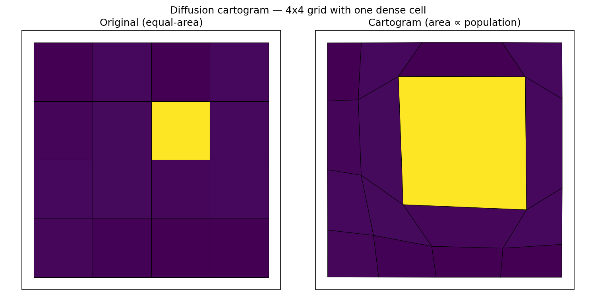
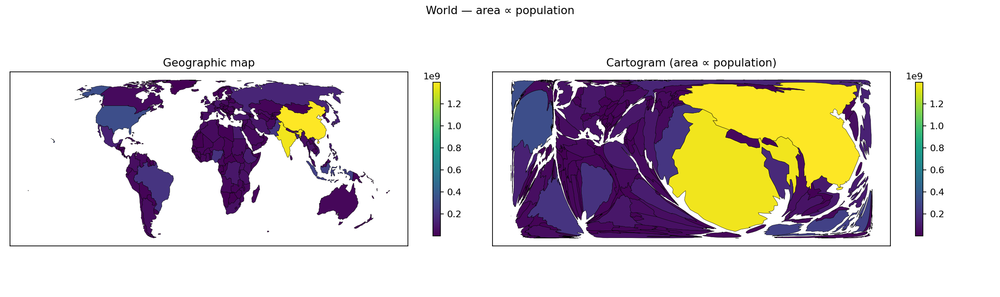
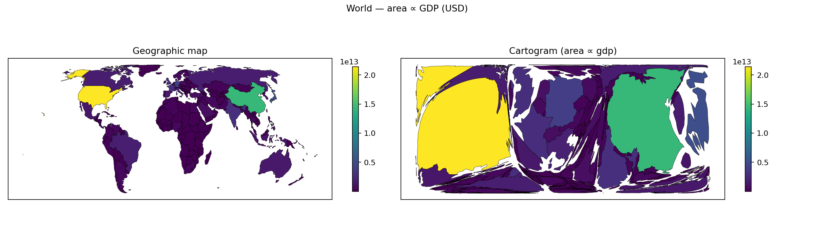
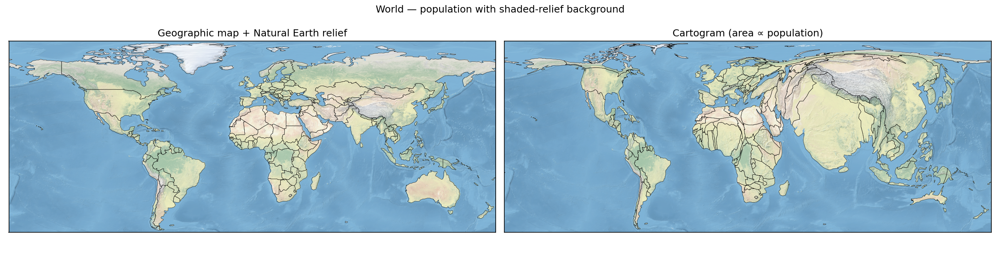

# Contiguous Cartograms

A small, auditable, pure-Python implementation of the
**Gastner–Newman diffusion cartogram algorithm** (PNAS 2004) for
producing *contiguous* density-equalising cartograms — maps where the
area of each region is proportional to some quantity (population, GDP,
votes, cases, …) while neighbouring regions stay attached and no
topology is destroyed.









## Mathematical background

Given a non-negative density `ρ₀(x, y)` on a rectangle, we look for a
smooth, invertible deformation `Φ : R² → R²` such that the pulled-back
density is uniform. Gastner & Newman construct `Φ` by solving the
diffusion equation on a Neumann box,

```
∂ρ/∂t = ∇²ρ ,    (∂ρ/∂n)|∂Ω = 0 ,
```

and advecting every point along the associated normalised flux

```
v(x, t) = − ∇ρ(x, t) / ρ(x, t) ,    dr/dt = v(r, t).
```

The position `r(∞)` is the cartogram coordinate of `r₀`. Because the
deformation is the flow of a smooth velocity field, it is a
homeomorphism — contiguity is preserved automatically.

Implementation:

* the heat equation is solved *exactly* on the Neumann box via DCT-II
  cosine expansion (so `ρ(t)` is available at any `t` with a single
  `O(N log N)` transform — no time-stepping for diffusion);
* the density is pre-smoothed with a small Gaussian so that the
  polygon-rasterisation step-functions do not make the advection ODE
  stiff at `t = 0` — this is mathematically equivalent to starting the
  heat equation at `t = σ² dx dy / 2`;
* the advection ODE is integrated with SciPy's adaptive RK45;
* country boundaries are densified via `shapely.segmentize` before
  transformation so long straight edges follow the flow faithfully.

## Installation

```bash
python3 -m venv .venv
source .venv/bin/activate
pip install -r requirements.txt

# Optional, needed only for world / shapefile examples:
pip install geopandas rasterio pillow
```

## Quick start — the Python API

### 1. Density grid → cartogram

```python
import numpy as np
from cartogram import Cartogram

# A 256 × 256 density grid.
rho = np.ones((256, 256))
rho[96:160, 96:160] = 5.0   # a dense central block

cart = Cartogram(rho, bbox=(0, 0, 1, 1))
cart.run()

# Deform arbitrary (x, y) points:
pts  = np.array([[0.25, 0.25], [0.75, 0.75]])
cart.transform(pts)          # -> cartogram coordinates
cart.inverse_transform(pts)  # -> pull-back
```

### 2. Polygons + per-polygon values → cartogram

```python
from shapely.geometry import Polygon
from cartogram import Cartogram, rasterize_polygons

polys = [Polygon([(0,0),(1,0),(1,1),(0,1)]),
         Polygon([(1,0),(2,0),(2,1),(1,1)])]
values = [3.0, 1.0]  # first cell is 3× the second

bbox = (0.0, 0.0, 2.0, 1.0)
rho  = rasterize_polygons(polys, values, bbox, (128, 256))

cart = Cartogram(rho, bbox=bbox)
cart.run()

new_polys = cart.transform_polygons(polys)
```

### 3. World map → cartogram (built-in data)

```python
from cartogram import WorldMap, Cartogram, rasterize_polygons

wm = WorldMap.load()              # Natural Earth admin-0, cached
wm = wm.pick("population")        # or "gdp", "gdp_per_capita"

bbox  = wm.padded_bbox(pad=0.02)
rho   = rasterize_polygons(list(wm.gdf.geometry),
                           list(wm.gdf["population"]),
                           bbox, (256, 512))
cart  = Cartogram(rho, bbox=bbox)
cart.run()

new_geoms = cart.transform_polygons(list(wm.gdf.geometry))
```

### 4. Bring your own per-country data

```python
from cartogram import WorldMap

# From a dict keyed by ISO3:
my_values = {"USA": 328.2, "CHN": 1398.0, "IND": 1366.0, ...}
wm = WorldMap.load().with_values(my_values, join_key="ISO_A3", as_column="pop")

# Or from a pandas DataFrame:
import pandas as pd
df = pd.DataFrame({"ISO_A3": ["USA", "DEU"], "value": [23.3, 4.3]})
wm = WorldMap.load().with_values(df, join_key="ISO_A3",
                                  value_key="value", as_column="gdp_trillions")
```

### 5. Warp a satellite / shaded-relief image through the cartogram

```python
import numpy as np
from PIL import Image
from cartogram import warp_image

img = np.asarray(Image.open("my_satellite_tile.png").convert("RGB"))
warped = warp_image(cart, img, image_bbox=bbox)  # RGB image, distorted
```

## Quick start — the CLI

```bash
# World cartograms (downloads Natural Earth data on first run):
python -m cartogram world --value population       --out pop.png
python -m cartogram world --value gdp              --out gdp.png
python -m cartogram world --value gdp_per_capita   --log --min-floor 0.05 \
                          --out gpc.png

# With a shaded-relief background (downloads Natural Earth raster):
python examples/world_satellite.py --value population
python examples/world_satellite.py --value gdp

# Import your own CSV values (CSV must have ISO_A3 + value columns):
python -m cartogram world --value custom \
    --csv my_data.csv --csv-iso-col iso3 --csv-value-col metric \
    --out custom.png

# Arbitrary shapefile + numeric column:
python -m cartogram shape states.shp --value POP2020 --out states.png
```

Full CLI options: `python -m cartogram world --help`.

## Repository layout

```
cartogram/
    __init__.py      # public API (lazy-loads optional GeoPandas surface)
    __main__.py      # "python -m cartogram" entry point
    diffusion.py     # DCT-II analytic heat-equation solver
    advect.py        # RK45 advection with bilinear velocity interpolation
    cartogram.py     # Cartogram high-level driver
    rasterize.py     # polygon -> density grid
    warp.py          # image warping through the inverse deformation
    world_data.py    # Natural Earth admin-0 loader + CSV-join helper
    cli.py           # argparse CLI
    io_utils.py      # deferred-import GeoPandas helpers
examples/
    synthetic.py         # minimal self-contained demo
    us_states.py         # contiguous-US population cartogram
    world_satellite.py   # world cartogram with shaded-relief background
tests/
    test_diffusion.py
    test_advect.py
docs/images/             # rendered demos checked into the repo
```

## Testing

```bash
pytest -q
```

The full suite (9 cases) runs in under 5 s on a laptop and requires no
network access and no GeoPandas.

## 20 ways this could be improved

1. **Finite-volume advection** — integrate the density transport
   equation directly on the grid (Gastner–Seguy–More 2018), avoiding
   the per-RK-step re-evaluation of the inverse DCT.
2. **JAX / PyTorch backend** — one-line autodiff + GPU support for the
   spectral diffusion step and bilinear sampler.
3. **Non-rectangular domains** — support arbitrary polygonal bounding
   shapes by masking the DCT or embedding in a larger rectangle with a
   soft boundary.
4. **Antimeridian-safe geometry preprocessing** — auto-split polygons
   at the dateline before reprojecting, so Russia, Fiji and Kiribati
   no longer need a carefully chosen central meridian.
5. **Topology-preserving post-corrections** — detect and repair the
   (rare) self-intersections that can appear when the density grid is
   too coarse or the deformation too violent.
6. **Area-accuracy diagnostics** — report, per region, the ratio
   `area_cartogram / value` and a global anisotropy score so users can
   tell when convergence is inadequate.
7. **Adaptive grid refinement** — start on a coarse grid, subdivide
   only in cells where the gradient is large, to resolve extreme
   concentrations (Singapore, Monaco) without blowing up memory.
8. **Non-contiguous + Dorling fallbacks** — offer alternative cartogram
   algorithms (Dorling circles, rectangular/mosaic) with the same data
   interface for cases where the contiguous style is unsuitable.
9. **Proper projection pipeline** — use `pyproj` to reproject both the
   grid and the background raster to an equal-area CRS inside the
   solver; currently the CLI relies on users picking a sane CRS.
10. **GeoTIFF input/output** — read weighted rasters directly (no
    polygon step) and emit the cartogram's displacement field as a
    GeoTIFF warp grid usable in GIS tools.
11. **Value transforms library** — ship first-class support for log,
    Box-Cox, quantile, winsorised, and "floor + scale" transforms so
    heavy-tailed quantities (GDP/capita) don't require manual tuning.
12. **Uncertainty quantification** — bootstrap over subsampled polygons
    or noisy values and produce a confidence band on each region's
    displacement.
13. **Animated morphs** — render the deformation as an MP4/GIF,
    interpolating the advection ODE output rather than only the final
    state.
14. **Interactive web viewer** — a tiny FastAPI + Leaflet frontend that
    streams the warped tiles, with live sliders for `mean_floor`,
    `blur_sigma`, and projection choice.
15. **Benchmark suite** — compare outputs and runtime against Gastner's
    reference `cart` C code and against `go-cart-wasm` on the standard
    test maps; fail CI on regressions beyond a tolerance.
16. **Smarter stopping criterion** — adaptively stop when the maximum
    grid-point velocity falls below a target fraction of the cell
    diagonal, rather than waiting for the slowest Fourier mode.
17. **Compiled hot loop** — the bilinear interpolator in
    `advect._bilinear_sample` is the innermost routine; a Cython or
    Numba version would give a 3–5× speed-up on large grids.
18. **Per-region minimum area** — optional constraint forcing every
    region to keep at least ε of its original area (prevents tiny
    nations from disappearing while still roughly honouring values).
19. **Automatic data discovery** — fetch, cache and join public data
    sources (World Bank, OWID, WHO) by name, so `python -m cartogram
    world --value "worldbank:SP.POP.TOTL" --year 2022` just works.
20. **Documentation site with case studies** — a Jupyter-Book build of
    the examples folder, with side-by-side renders, algorithm notes
    keyed to equation numbers in the paper, and a gallery of user
    contributions.

## References

* M. T. Gastner & M. E. J. Newman, *Diffusion-based method for producing
  density-equalizing maps*, PNAS **101** (20), 7499–7504 (2004).
* M. T. Gastner, V. Seguy & P. More, *Fast flow-based algorithm for
  creating density-equalizing map projections*, PNAS **115** (10),
  E2156–E2164 (2018).

## License

MIT — see `LICENSE`.
