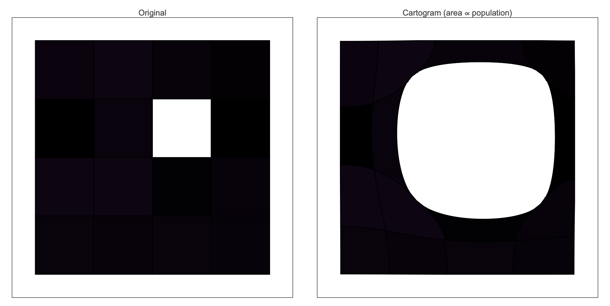
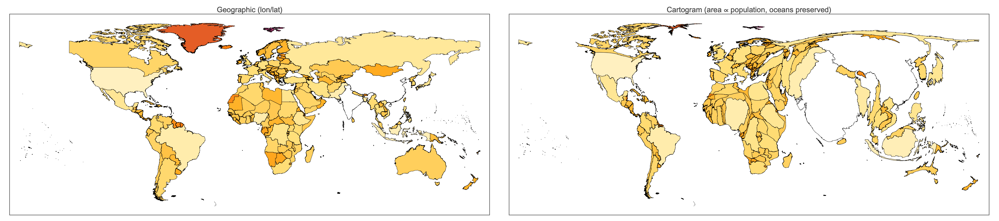

# CartogramWL — Wolfram-Language port

A from-scratch port of the Gastner–Newman diffusion cartogram
algorithm to the Wolfram Language. Mirrors the Python package in the
parent directory: same math, same grid convention, same behaviour.

## Demos

### Synthetic — 4×4 grid with one dense cell



### World — population cartogram (oceans preserved)

Built from Wolfram's bundled `CountryData`.



## Requirements

* Wolfram Engine / Mathematica ≥ 13.0 (tested on WolframKernel 15.0).
* `wolframscript` on `$PATH` for the command-line runner.

Nothing else — the package uses only built-in symbols.

## Layout

```
wolfram/
    CartogramWL/
        CartogramWL.wl     # the package
    examples/
        synthetic.wls      # 4x4 synthetic demo
        world.wls          # world population cartogram
    tests/
        test_basic.wls     # 7 regression tests
    docs/images/           # generated PNGs committed with the repo
```

## Running

```bash
cd wolfram

# Sanity tests (a few seconds):
wolframscript -file tests/test_basic.wls

# Synthetic demo (~5 s):
wolframscript -file examples/synthetic.wls

# World demo (~1 min, uses Wolfram's CountryData so no download):
wolframscript -file examples/world.wls
```

## API cheat sheet

```wolfram
Needs["CartogramWL`"];

(* 1. Build a cartogram from a density grid. *)
solver = DiffusionSolver[rho0, {xmin, ymin, xmax, ymax}];
rhoAtT = DensityAt[solver, t];

(* 2. Flow arbitrary points through the velocity field. *)
pts    = AdvectPoints[solver, {{x1, y1}, {x2, y2}, ...}];

(* 3. High-level driver. *)
cart = Cartogram[rho, bbox,
    "MeanFloor"   -> 0.02,
    "BlurSigma"   -> 1.5,
    "SeaDensity"  -> "auto"];     (* "auto" = preserve ocean area *)
cart = CartogramRun[cart, "Tol" -> 2.*^-3];

newPts   = CartogramTransform[cart, pts];
newPoly  = CartogramTransformPolygon[cart, polyCoords];

(* 4. Rasterise polygons + values to a density grid. *)
rho = RasterizePolygons[polyList, values, bbox, {ny, nx}, subpixel];
```

Conventions:

* Density arrays are `rho[[i, j]]` with row index `i ↦ y`, column
  index `j ↦ x` (same as NumPy).
* `bbox = {xmin, ymin, xmax, ymax}`.
* Polygons are lists of `{x, y}` pairs (single exterior ring per
  polygon — pass one ring at a time to `CartogramTransformPolygon`).

## Algorithm notes (same as the Python side)

1. Diffusion is solved analytically on the Neumann box via a 2-D
   DCT-II cosine expansion. Wolfram's `FourierDCT[·, 2]` /
   `FourierDCT[·, 3]` are already N-dimensional and orthonormal, so
   the forward/inverse pair is a single call each. The density at any
   time `t` is then

   ```
   rho(·, t) = idct2[ coeffs * Exp[-lambda * t] ]
   ```

   where `lambda[i, j] = pi^2 ((j/Lx)^2 + (i/Ly)^2)` — the standard
   Neumann eigenvalues of -Laplacian.

2. The velocity field `v = -grad(rho)/rho` is evaluated on the grid
   by central differences and interpolated bilinearly at advected
   points. Points are integrated through `v` with `NDSolveValue`
   using an explicit RK5 scheme.

3. The input density is pre-smoothed with `GaussianFilter` (default
   σ = 1 cell) — mathematically equivalent to starting diffusion at
   `t = σ² dx dy / 2` — so the polygon-rasterisation step-functions
   don't make the initial velocity field stiff.

4. `SeaDensity -> "auto"` fills ocean cells (cells with zero input
   density) with the mean of the land cells, so the spatial mean is
   uniform across the domain and only the *relative* sizes of
   countries change. Oceans stay put.

## Relationship to the Python package

The Wolfram port stays intentionally thin:

| Concern | Python | Wolfram |
|---|---|---|
| Diffusion solver | `cartogram/diffusion.py`       | `DiffusionSolver[…]`            |
| Advection        | `cartogram/advect.py` (SciPy)  | `AdvectPoints[…]` (`NDSolveValue`) |
| High-level class | `Cartogram`                    | `Cartogram[…]` association       |
| Polygon warp     | `transform_polygons`           | `CartogramTransformPolygon`      |
| Rasteriser       | `rasterize_polygons`           | `RasterizePolygons[…]`           |
| Ocean preservation | `sea_density="auto"`         | `"SeaDensity" -> "auto"`         |

The Python package is the more feature-complete of the two — it has
the Gradio GUI, the live World Bank/WHO fetchers, the Natural Earth
shaded-relief warper, and a CLI. The Wolfram port is designed for
users who'd rather stay inside Mathematica and reach the core
algorithm + built-in `CountryData` in a few lines.

## License

MIT — same as the parent repository.
